# 📦 winget-update.ps1

> **Silently updates all Microsoft Store applications using Windows Package Manager**

> [!TIP]
> Run this script with Administrator privileges for machine-wide app updates.

> [!NOTE]
> **Target Audience:** System Administrators, DevOps Engineers  
> **Reading Time:** ~12 minutes

<details>
<summary>📍 Navigation</summary>

| Previous | Index | Next |
|:---------|:-----:|-----:|
| [← cleanUp.ps1](clean-up.md) | [Scripts Index](../README.md) | [GitHub Scripts →](../github/create-github-secret-azure-credentials.md) |

</details>

---

## 📑 Table of Contents

- [🎯 Overview](#overview)
- [📊 Flow Visualization](#flow-visualization)
- [🔄 Update Process Flow](#update-process-flow)
- [📝 Parameters](#parameters)
- [⚙️ Prerequisites](#prerequisites)
- [🛠️ Configuration](#configuration)
- [🔧 Functions Reference](#functions-reference)
- [📝 Usage Examples](#usage-examples)
- [⚠️ Error Handling](#error-handling)
- [🔍 Troubleshooting](#troubleshooting)
- [🔄 DSC Integration](#dsc-integration)
- [🔒 Security Considerations](#security-considerations)
- [🔗 Related Files](#related-files)

---

## 🎯 Overview

This script performs a comprehensive, non-interactive update of all Microsoft Store applications using Windows Package Manager (winget). It handles self-updates of winget, runs multiple passes to catch stubborn apps, and maintains detailed logging.

---

[⬆️ Back to Top](#-table-of-contents)

---

## 📊 Flow Visualization

```mermaid
---
title: WinGet Update Flow
---
flowchart TD
    %% ===== SCRIPT ENTRY =====
    subgraph Entry["📥 Script Entry"]
        A(["🚀 winget-update.ps1 Start"])
        B["📝 Configure logging"]
        C["🔐 Set ExecutionPolicy Bypass"]
    end
    
    %% ===== PREFLIGHT CHECKS =====
    subgraph Preflight["✅ Preflight Checks"]
        D["🔍 Resolve-WinGetExecutable"]
        E["🧪 Test-WinGetAvailability"]
        F{"📋 WinGet available?"}
    end
    
    %% ===== SERVICE PREPARATION =====
    subgraph Services["⚙️ Service Preparation"]
        G["🚀 Start-StoreInstallService"]
        H["🔄 Initialize-WinGetSources"]
    end
    
    %% ===== UPDATE PASSES =====
    subgraph Updates["📦 Update Passes"]
        I["⬆️ Update-MicrosoftStoreApps"]
        I1["📋 Pass 1: Standard upgrade"]
        I2["🔧 Pass 2: Forced upgrade"]
        I3["🛡️ Pass 3: Safety net pass"]
        I4["📊 Summary check"]
    end
    
    %% ===== SCRIPT EXIT =====
    subgraph Exit["📤 Script Exit"]
        J[\"🎉 Updates Complete"\]
        K{{"❌ Error Exit"}}
    end
    
    %% ===== CONNECTIONS =====
    A -->|configures| B -->|sets| C -->|resolves| D -->|tests| E -->|evaluates| F
    F -->|No| K
    F -->|Yes| G -->|initializes| H -->|updates| I
    I -->|runs| I1 -->|forces| I2 -->|safety| I3 -->|summarizes| I4 -->|completes| J

    %% ===== STYLES =====
    classDef trigger fill:#818CF8,stroke:#4F46E5,color:#FFFFFF
    classDef primary fill:#4F46E5,stroke:#3730A3,color:#FFFFFF
    classDef secondary fill:#10B981,stroke:#059669,color:#FFFFFF
    classDef external fill:#6B7280,stroke:#4B5563,color:#FFFFFF,stroke-dasharray:5 5
    classDef decision fill:#FFFBEB,stroke:#F59E0B,color:#000000
    classDef failed fill:#F44336,stroke:#C62828,color:#FFFFFF
    
    class A trigger
    class B,C,D,E,G,H primary
    class F decision
    class I,I1,I2,I3,I4 secondary
    class J secondary
    class K failed
    
    %% ===== SUBGRAPH STYLES =====
    style Entry fill:#EEF2FF,stroke:#4F46E5,stroke-width:2px
    style Preflight fill:#E0E7FF,stroke:#4F46E5,stroke-width:2px
    style Services fill:#E0E7FF,stroke:#4F46E5,stroke-width:2px
    style Updates fill:#ECFDF5,stroke:#10B981,stroke-width:2px
    style Exit fill:#FEF3C7,stroke:#F59E0B,stroke-width:2px
```



---

[⬆️ Back to Top](#-table-of-contents)

---

## 🔄 Update Process Flow


---

[⬆️ Back to Top](#-table-of-contents)

---

## 📝 Parameters

This script has no parameters. All configuration is handled internally.

---

[⬆️ Back to Top](#-table-of-contents)

---

## ⚙️ Prerequisites

### Required Tools

| Tool | Purpose | Installation |
|------|---------|--------------|
| Windows Package Manager (`winget`) | Package management | Pre-installed or via [App Installer](https://apps.microsoft.com/store/detail/app-installer/9NBLGGH4NNS1) |
| PowerShell 5.1+ | Script execution | Pre-installed on Windows |

### Recommended Execution Context

- **Elevated (Administrator)**: Required for machine-wide app updates
- **Standard User**: Will update user-scoped apps only

---

[⬆️ Back to Top](#-table-of-contents)

---

## 🛠️ Configuration

### Environment Variables Set

| Variable | Value | Purpose |
|----------|-------|---------|
| `WINGET_DISABLE_INTERACTIVITY` | `1` | Prevents all prompts |

### Script Preferences

| Preference | Value | Purpose |
|------------|-------|---------|
| `$ErrorActionPreference` | `Stop` | Terminate on errors |
| `$ProgressPreference` | `SilentlyContinue` | Suppress progress bars |
| `ExecutionPolicy` | `Bypass` (Process) | Allow script execution |

### Logging

- **Log Directory:** `C:\ProgramData\Winget-StoreUpgrade\`
- **Log File Format:** `upgrade-YYYYMMDD-HHMMSS.log`
- **Log Levels:** `[INFO ]`, `[WARN ]`, `[ERROR]`

---

[⬆️ Back to Top](#-table-of-contents)

---

## 🔧 Functions Reference

### Function: `Write-LogInfo`

**Purpose:** Writes an informational message to console and log file.

**Parameters:**

| Name | Type | Description |
|------|------|-------------|
| `Message` | `string` | Message to write |

---

### Function: `Write-LogWarning`

**Purpose:** Writes a warning message to console and log file.

---

### Function: `Write-LogError`

**Purpose:** Writes an error message to console and log file.

---

### Function: `Resolve-WinGetExecutable`

**Purpose:** Finds the path to winget.exe, preferring the packaged App Installer location.

**Returns:** `[string]` - Full path to winget.exe

**Resolution Order:**

1. Packaged App Installer location (via `Get-AppxPackage`)
2. PowerShell command resolution (fallback)

---

### Function: `Invoke-WinGetCommand`

**Purpose:** Executes winget with proper logging and retry on self-update.

**Parameters:**

| Name | Type | Required | Description |
|------|------|----------|-------------|
| `CommandArgs` | `string[]` | Yes | Arguments to pass to winget |
| `RetryOnSelfUpdate` | `switch` | No | Retry if winget updated itself |

**Returns:** `[string]` - Output from winget command

**Self-Update Handling:**

- Detects "Restart the application to complete the upgrade"
- Re-resolves winget path and retries once

---

### Function: `Test-WinGetAvailability`

**Purpose:** Verifies winget is installed and working.

**Returns:** `[bool]` - `$true` if winget is available

---

### Function: `Start-StoreInstallService`

**Purpose:** Ensures Microsoft Store Install Service is running.

**Service:** `InstallService`

---

### Function: `Initialize-WinGetSources`

**Purpose:** Verifies and updates winget sources.

**Behavior:**

1. Checks if `msstore` source exists
2. Resets source if missing
3. Updates all sources

---

### Function: `Update-MicrosoftStoreApps`

**Purpose:** Performs multi-pass update of all Microsoft Store apps.

**Update Passes:**

| Pass | Purpose | Flags |
|------|---------|-------|
| 1 | Standard upgrade | `--include-unknown --silent` |
| 2 | Forced upgrade | `--force --silent` |
| 3 | Safety net | Unfiltered (all sources) |

**Common Flags for All Passes:**

- `--accept-source-agreements`
- `--accept-package-agreements`
- `--disable-interactivity`

---

[⬆️ Back to Top](#-table-of-contents)

---

## 📝 Usage Examples

### Standard Execution

```powershell
.\winget-update.ps1
```

### With Elevated Privileges

```powershell
# Run as Administrator for machine-wide updates
Start-Process powershell -Verb RunAs -ArgumentList "-File `".\winget-update.ps1`""
```

<details>
<summary>Expected Console Output</summary>

```
[INFO ] Log file: C:\ProgramData\Winget-StoreUpgrade\upgrade-20250123-143022.log
[INFO ] Starting Microsoft Store updates...
[INFO ] Pass 1: upgrading Microsoft Store apps (include-unknown)...
[INFO ] Pass 2: forced upgrade (msstore) for remaining/unknown version apps...
[INFO ] Safety net: unfiltered pass to catch any remaining packages...
[INFO ] Summary check for remaining Microsoft Store upgrades...
[INFO ] Completed. Full log: C:\ProgramData\Winget-StoreUpgrade\upgrade-20250123-143022.log
```

</details>

<details>
<summary>Example Log File Contents</summary>

```
[INFO ] Log file: C:\ProgramData\Winget-StoreUpgrade\upgrade-20250123-143022.log
[INFO ] Starting Microsoft Store updates...
[INFO ] Pass 1: upgrading Microsoft Store apps (include-unknown)...
Name             Id                                  Version       Available     Source
---------------  ----------------------------------  -----------   -----------   ------
Microsoft To Do  Microsoft.Todos                     2.97.123.0    2.98.456.0    msstore
...
[INFO ] Pass 2: forced upgrade (msstore) for remaining/unknown version apps...
No applicable upgrade found.
[INFO ] Safety net: unfiltered pass to catch any remaining packages...
No applicable upgrade found.
[INFO ] Summary check for remaining Microsoft Store upgrades...
No applicable upgrade found.
[INFO ] Completed. Full log: C:\ProgramData\Winget-StoreUpgrade\upgrade-20250123-143022.log
```

</details>

---

[⬆️ Back to Top](#-table-of-contents)

---

## ⚠️ Error Handling

### Exit Codes

| Code | Meaning |
|------|---------|
| `0` | Updates completed (may include skipped apps) |
| `1` | Critical failure (winget not found, etc.) |

### Graceful Degradation

- Source operation failures trigger warnings but don't stop execution
- Individual app update failures don't stop the process
- Service start failures are logged as warnings

---

[⬆️ Back to Top](#-table-of-contents)

---

## 🔍 Troubleshooting

### Common Issues

| Issue | Cause | Solution |
|-------|-------|----------|
| "winget not found" | App Installer not installed | Install from Microsoft Store |
| No updates applied | All apps current | Check log for details |
| Permission errors | Not running elevated | Run as Administrator |
| Self-update loop | Winget updating repeatedly | Allow self-update to complete |

### Check Log File

```powershell
# View latest log
Get-Content "C:\ProgramData\Winget-StoreUpgrade\upgrade-*.log" | Select-Object -Last 50
```

### Verify WinGet Version

```powershell
winget --version
```

### Manual Source Reset

```powershell
winget source reset --force
winget source update
```

---

[⬆️ Back to Top](#-table-of-contents)

---

## 🔄 DSC Integration

This script is designed to work with Windows Desired State Configuration (DSC). Related DSC files:

| File | Purpose |
|------|---------|
| `winget-upgrade-packages.dsc.yaml` | DSC configuration for package updates |
| `common-config.dsc.yaml` | Common DSC configuration |

---

[⬆️ Back to Top](#-table-of-contents)

---

## 🔒 Security Considerations

### Execution Policy

The script sets `ExecutionPolicy Bypass` for the current process only:

```powershell
Set-ExecutionPolicy Bypass -Scope Process -Force
```

This does not affect system-wide policy.

### Logging Location

Logs are written to `C:\ProgramData\`:

- Accessible by all users
- Persists across reboots
- May contain package names and versions

### Source Agreements

The script automatically accepts:

- Source agreements (`--accept-source-agreements`)
- Package agreements (`--accept-package-agreements`)

Review these agreements at [Microsoft Store Terms](https://www.microsoft.com/store/b/terms-of-use).

---

[⬆️ Back to Top](#-table-of-contents)

---

## 🔗 Related Files

| File | Purpose | Location |
|------|---------|----------|
| `winget-upgrade-packages.dsc.yaml` | DSC configuration | Same directory |
| `common-config.dsc.yaml` | Common workload config | Same directory |
| `common-backend-config.dsc.yaml` | Backend workload config | Same directory |

---

<div align="center">

[← cleanUp.ps1](clean-up.md) | [⬆️ Back to Top](#-table-of-contents) | [GitHub Scripts →](../github/create-github-secret-azure-credentials.md)

*DevExp-DevBox • winget-update.ps1 Documentation*

</div>
