# 🐙 GitHub PowerShell Scripts

> **Documentation for GitHub repository secret management scripts**

> [!NOTE]
> **Target Audience:** DevOps Engineers, Platform Engineers  
> **Reading Time:** ~3 minutes

<details>
<summary>📍 Navigation</summary>

| Previous | Index | Next |
|:---------|:-----:|-----:|
| [← Azure Scripts](../azure/README.md) | [Docs Index](../../README.md) | [Configuration Scripts →](../configuration/clean-up.md) |

</details>

---

## 📑 Table of Contents

- [🎯 Overview](#-overview)
- [📜 Scripts Inventory](#-scripts-inventory)
- [🔄 Workflow Diagram](#-workflow-diagram)
- [⚙️ Prerequisites](#-prerequisites)
- [🚀 Quick Start](#-quick-start)
- [🔗 Related Documentation](#-related-documentation)

---

## 🎯 Overview

This folder contains PowerShell scripts for managing GitHub repository secrets. These scripts are essential for setting up secure CI/CD pipelines by storing Azure credentials in GitHub for use with GitHub Actions workflows.

---

[⬆️ Back to Top](#-table-of-contents)

---

## 📜 Scripts Inventory

| Script | Purpose | Documentation |
|:-------|:--------|:--------------|
| 🔐 `createGitHubSecretAzureCredentials.ps1` | Creates `AZURE_CREDENTIALS` secret for GitHub Actions | [create-github-secret-azure-credentials.md](create-github-secret-azure-credentials.md) |
| 🗑️ `deleteGitHubSecretAzureCredentials.ps1` | Removes GitHub repository secrets | [delete-github-secret-azure-credentials.md](delete-github-secret-azure-credentials.md) |

---

[⬆️ Back to Top](#-table-of-contents)

---

## 🔄 Workflow Diagram

```mermaid
---
title: GitHub Scripts Workflow
---
flowchart LR
    %% ===== SETUP PHASE =====
    subgraph Setup["🚀 Setup Phase"]
        direction TB
        A["🔐 createGitHubSecretAzureCredentials.ps1"]
    end
    
    %% ===== CLEANUP PHASE =====
    subgraph Cleanup["🗑️ Cleanup Phase"]
        direction TB
        B["🗑️ deleteGitHubSecretAzureCredentials.ps1"]
    end
    
    %% ===== CONNECTIONS =====
    A -.->|"Reverse Operation"| B

    %% ===== NODE STYLES =====
    classDef secondary fill:#10B981,stroke:#059669,color:#FFFFFF
    classDef failed fill:#F44336,stroke:#C62828,color:#FFFFFF
    
    class A secondary
    class B failed

    %% ===== SUBGRAPH STYLES =====
    style Setup fill:#ECFDF5,stroke:#10B981,stroke-width:2px
    style Cleanup fill:#FEE2E2,stroke:#F44336,stroke-width:2px
```



---

[⬆️ Back to Top](#-table-of-contents)

---

## ⚙️ Prerequisites

> [!IMPORTANT]
> All scripts require the following tools and permissions to be configured.

### Required Tools

| Tool | Purpose | Installation |
|:-----|:--------|:-------------|
| GitHub CLI (`gh`) | Manage repository secrets | [Install GitHub CLI](https://cli.github.com/) |
| PowerShell 5.1+ | Script execution | Pre-installed on Windows |

### Required Permissions

| Permission | Scripts | Purpose |
|:-----------|:--------|:--------|
| **Repository Admin** or **Secrets Write** | All scripts | Create/delete repository secrets |
| **GitHub CLI Authentication** | All scripts | `gh auth login` with `repo` scope |

---

[⬆️ Back to Top](#-table-of-contents)

---

## 🚀 Quick Start

### Create Secret

> [!TIP]
> This script is typically called by `generateDeploymentCredentials.ps1`, not run directly.

```powershell
# 1. Login to GitHub CLI
gh auth login

# 2. Navigate to repository directory
cd path/to/your/repo

# 3. Create secret with Azure credentials JSON
$creds = az ad sp create-for-rbac --name "my-sp" --role Contributor --json-auth
.\createGitHubSecretAzureCredentials.ps1 -GhSecretBody $creds
```

### Delete Secret

> [!WARNING]
> Deleting secrets immediately affects any workflows using them.

```powershell
# Remove the AZURE_CREDENTIALS secret
.\deleteGitHubSecretAzureCredentials.ps1 -GhSecretName "AZURE_CREDENTIALS"
```

---

[⬆️ Back to Top](#-table-of-contents)

---

## 🔗 Related Documentation

| Document | Description |
|:---------|:------------|
| [Scripts Index](../README.md) | Main scripts documentation |
| [Azure Scripts](../azure/README.md) | Azure RBAC and credential management scripts |
| [generateDeploymentCredentials.ps1](../azure/generate-deployment-credentials.md) | Creates SP and calls GitHub secret script |
| [Deployment Architecture](../../architecture/07-deployment-architecture.md) | CI/CD pipeline configuration |

---

[⬆️ Back to Top](#-table-of-contents)

---

<div align="center">

[← Azure Scripts](../azure/README.md) | [⬆️ Back to Top](#-table-of-contents) | [Configuration Scripts →](../configuration/clean-up.md)

*DevExp-DevBox • GitHub Scripts Documentation*

</div>
