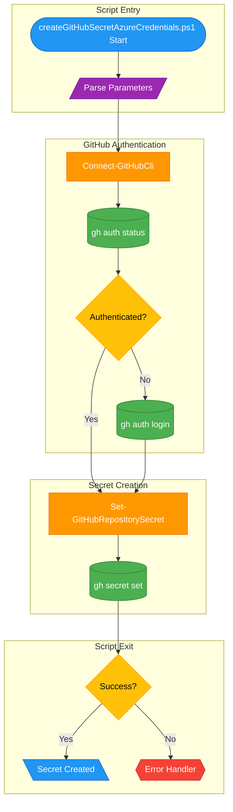

# 🔐 createGitHubSecretAzureCredentials.ps1

> **Creates a GitHub repository secret for Azure service principal credentials**

> [!NOTE]
> **Target Audience:** DevOps Engineers, Platform Engineers  
> **Reading Time:** ~10 minutes

<details>
<summary>📍 Navigation</summary>

| Previous | Index | Next |
|:---------|:-----:|-----:|
| [← winget-update.ps1](../configuration/winget-update.md) | [Scripts Index](../README.md) | [deleteGitHubSecretAzureCredentials.ps1 →](delete-github-secret-azure-credentials.md) |

</details>

---

## 📑 Table of Contents

- [🎯 Overview](#overview)
- [📊 Flow Visualization](#flow-visualization)
- [📝 Parameters](#parameters)
- [⚙️ Prerequisites](#prerequisites)
- [📥 Expected Input Format](#expected-input-format)
- [🔧 Functions Reference](#functions-reference)
- [📝 Usage Examples](#usage-examples)
- [⚙️ Using the Secret in GitHub Actions](#using-the-secret-in-github-actions)
- [⚠️ Error Handling](#error-handling)
- [🛠️ Troubleshooting](#troubleshooting)
- [🔒 Security Considerations](#security-considerations)
- [🔗 Related Scripts](#related-scripts)

---

## 🎯 Overview

This script authenticates to GitHub using the GitHub CLI and creates a repository secret named `AZURE_CREDENTIALS` containing Azure service principal credentials for use in GitHub Actions workflows.

---

[⬆️ Back to Top](#-table-of-contents)

---

## 📊 Flow Visualization



---

[⬆️ Back to Top](#-table-of-contents)

---

## 📝 Parameters

| Parameter | Type | Required | Default | Validation | Description |
|-----------|------|----------|---------|------------|-------------|
| `-GhSecretBody` | `string` | Yes | - | `ValidateNotNullOrEmpty` | JSON body containing Azure credentials |

**Aliases:** `ghSecretBody`

---

[⬆️ Back to Top](#-table-of-contents)

---

## ⚙️ Prerequisites

### Required Tools

| Tool | Purpose | Installation |
|------|---------|--------------|
| GitHub CLI (`gh`) | Manage repository secrets | [Install GitHub CLI](https://cli.github.com/) |
| PowerShell 5.1+ | Script execution | Pre-installed on Windows |

### Required Permissions

- **GitHub**: Repository admin or secrets write permission
- Must be in a Git repository directory or specify repository

---

[⬆️ Back to Top](#-table-of-contents)

---

## 📥 Expected Input Format

The `GhSecretBody` parameter should contain Azure service principal credentials in this JSON format:

```json
{
  "clientId": "xxxxxxxx-xxxx-xxxx-xxxx-xxxxxxxxxxxx",
  "clientSecret": "xxxxxxxxxxxxxxxxxxxxxxxxxxxxxxxxxx",
  "subscriptionId": "xxxxxxxx-xxxx-xxxx-xxxx-xxxxxxxxxxxx",
  "tenantId": "xxxxxxxx-xxxx-xxxx-xxxx-xxxxxxxxxxxx"
}
```

This format is output by `az ad sp create-for-rbac --json-auth`.

---

[⬆️ Back to Top](#-table-of-contents)

---

## 🔧 Functions Reference

### Function: `Connect-GitHubCli`

**Purpose:** Ensures GitHub CLI is authenticated, prompting for login if needed.

**Parameters:** None

**Returns:** `[bool]` - `$true` if authenticated successfully, `$false` otherwise

**Behavior:**

1. Checks authentication status with `gh auth status`
2. If not authenticated, triggers `gh auth login` interactive flow
3. Returns success/failure status

---

### Function: `Set-GitHubRepositorySecret`

**Purpose:** Creates or updates a GitHub repository secret.

**Parameters:**

| Name | Type | Required | Description |
|------|------|----------|-------------|
| `SecretName` | `string` | Yes | Name of the secret |
| `SecretValue` | `string` | Yes | Value to store |

**Returns:** `[bool]` - `$true` if secret set successfully, `$false` otherwise

**Command:** `gh secret set {SecretName} --body {SecretValue}`

---

[⬆️ Back to Top](#-table-of-contents)

---

## 📝 Usage Examples

### Direct Execution with JSON

```powershell
$creds = @'
{
  "clientId": "12345678-1234-1234-1234-123456789012",
  "clientSecret": "mySecretValue123",
  "subscriptionId": "12345678-1234-1234-1234-123456789012",
  "tenantId": "12345678-1234-1234-1234-123456789012"
}
'@

.\createGitHubSecretAzureCredentials.ps1 -GhSecretBody $creds
```

### From Service Principal Creation

```powershell
# Create service principal and capture output
$creds = az ad sp create-for-rbac --name "my-sp" --role Contributor --json-auth

# Create GitHub secret
.\createGitHubSecretAzureCredentials.ps1 -GhSecretBody $creds
```

<details>
<summary>Expected Output</summary>

```
Creating GitHub secret for Azure credentials...
Checking GitHub authentication status...
Already authenticated to GitHub.
Setting GitHub secret: AZURE_CREDENTIALS
GitHub secret 'AZURE_CREDENTIALS' set successfully.

GitHub secret 'AZURE_CREDENTIALS' created successfully.
You can now use this secret in your GitHub Actions workflows.
```

</details>

---

[⬆️ Back to Top](#-table-of-contents)

---

## ⚙️ Using the Secret in GitHub Actions

After creating the secret, use it in your workflow:

```yaml
name: Deploy to Azure
on: [push]

jobs:
  deploy:
    runs-on: ubuntu-latest
    steps:
      - uses: actions/checkout@v4
      
      - name: Azure Login
        uses: azure/login@v2
        with:
          creds: ${{ secrets.AZURE_CREDENTIALS }}
      
      - name: Deploy resources
        run: |
          az group create --name my-rg --location eastus
```

---

[⬆️ Back to Top](#-table-of-contents)

---

## ⚠️ Error Handling

### Error Action Preference

```powershell
$ErrorActionPreference = 'Stop'
$WarningPreference = 'Stop'
```

### Exit Codes

| Code | Meaning |
|------|---------|
| `0` | Secret created successfully |
| `1` | Secret creation failed |

---

[⬆️ Back to Top](#-table-of-contents)

---

## 🛠️ Troubleshooting

### Common Issues

| Issue | Cause | Solution |
|-------|-------|----------|
| "Failed to authenticate to GitHub" | gh login failed or cancelled | Run `gh auth login` manually |
| "Failed to set GitHub secret" | No repository context | Run from Git repository directory |
| "Secret name invalid" | Special characters in name | Use alphanumeric and underscore only |
| "Permission denied" | Insufficient repo permissions | Verify admin access |

### Verify Secret Creation

```powershell
# List repository secrets
gh secret list
```

### Check GitHub Authentication

```powershell
# Verify authentication status
gh auth status

# View authenticated scopes
gh auth token
```

---

[⬆️ Back to Top](#-table-of-contents)

---

## 🔒 Security Considerations

### Secret Handling

- Secret value is passed via `--body` parameter (not stdin)
- Value is encrypted before storage in GitHub
- Secret cannot be read after creation (only updated/deleted)

### Audit Trail

- GitHub audit logs record secret creation/modification
- Workflow runs log secret usage (value masked)

### Secret Rotation

When rotating credentials:

1. Create new service principal credentials
2. Update secret with same command (overwrites existing)
3. Delete old service principal

---

[⬆️ Back to Top](#-table-of-contents)

---

## 🔗 Related Scripts

| Script | Purpose | Link |
|--------|---------|------|
| `deleteGitHubSecretAzureCredentials.ps1` | Remove GitHub secret | [delete-github-secret-azure-credentials.md](delete-github-secret-azure-credentials.md) |
| `generateDeploymentCredentials.ps1` | Create SP and call this script | [../azure/generate-deployment-credentials.md](../azure/generate-deployment-credentials.md) |
| `cleanSetUp.ps1` | Full environment cleanup | [../clean-setup.md](../clean-setup.md) |

---

<div align="center">

[← winget-update.ps1](../configuration/winget-update.md) | [⬆️ Back to Top](#-table-of-contents) | [deleteGitHubSecretAzureCredentials.ps1 →](delete-github-secret-azure-credentials.md)

*DevExp-DevBox • createGitHubSecretAzureCredentials.ps1 Documentation*

</div>
