# 🗑️ deleteGitHubSecretAzureCredentials.ps1

> **Removes a GitHub repository secret**

> [!WARNING]
> Deleting the secret will **immediately** affect any workflows using it.

> [!NOTE]
> **Target Audience:** DevOps Engineers, Platform Engineers  
> **Reading Time:** ~8 minutes

<details>
<summary>📍 Navigation</summary>

| Previous | Index | Next |
|:---------|:-----:|-----:|
| [← createGitHubSecretAzureCredentials.ps1](create-github-secret-azure-credentials.md) | [Scripts Index](../README.md) | — |

</details>

---

## 📑 Table of Contents

- [🎯 Overview](#-overview)
- [📊 Flow Visualization](#-flow-visualization)
- [📝 Parameters](#-parameters)
- [⚙️ Prerequisites](#️-prerequisites)
- [🔧 Functions Reference](#-functions-reference)
- [📝 Usage Examples](#-usage-examples)
- [⚠️ Error Handling](#️-error-handling)
- [🛠️ Troubleshooting](#️-troubleshooting)
- [🔒 Security Considerations](#-security-considerations)
- [🔗 Related Scripts](#-related-scripts)

---

## 🎯 Overview

This script authenticates to GitHub using the GitHub CLI and removes a specified secret from the current repository. Typically used to remove the `AZURE_CREDENTIALS` secret during cleanup operations.

---

[⬆️ Back to Top](#️-deleteGitHubSecretAzureCredentialsps1)

---

## 📊 Flow Visualization

```mermaid
---
title: Delete GitHub Secret Flow
---
flowchart TD
    %% ===== SCRIPT ENTRY =====
    subgraph Entry["📥 Script Entry"]
        A(["🚀 deleteGitHubSecretAzureCredentials.ps1 Start"])
        B[/"📝 Parse Parameters"/]
    end
    
    %% ===== GITHUB AUTHENTICATION =====
    subgraph Auth["🔐 GitHub Authentication"]
        C["⚙️ Connect-GitHubCli"]
        D[("🐙 gh auth status")]
        E{"✅ Authenticated?"}
        F[("🔑 gh auth login")]
    end
    
    %% ===== SECRET DELETION =====
    subgraph SecretDeletion["🗑️ Secret Deletion"]
        G["⚙️ Remove-GitHubRepositorySecret"]
        H[("🗑️ gh secret remove")]
        I{"📋 Secret existed?"}
    end
    
    %% ===== SCRIPT EXIT =====
    subgraph Exit["📤 Script Exit"]
        J[\"🎉 Secret Removed"\]
        K[\"⏭️ Secret Not Found - OK"\]
        L{{"❌ Error Handler"}}
    end
    
    %% ===== CONNECTIONS =====
    A -->|parses| B -->|connects| C -->|checks| D -->|evaluates| E
    E -->|Yes| G
    E -->|No| F -->|authenticates| G
    G -->|removes| H -->|evaluates| I
    I -->|Yes| J
    I -->|No| K

    %% ===== STYLES =====
    classDef trigger fill:#818CF8,stroke:#4F46E5,color:#FFFFFF
    classDef input fill:#F59E0B,stroke:#D97706,color:#000000
    classDef primary fill:#4F46E5,stroke:#3730A3,color:#FFFFFF
    classDef external fill:#6B7280,stroke:#4B5563,color:#FFFFFF,stroke-dasharray:5 5
    classDef decision fill:#FFFBEB,stroke:#F59E0B,color:#000000
    classDef secondary fill:#10B981,stroke:#059669,color:#FFFFFF
    classDef failed fill:#F44336,stroke:#C62828,color:#FFFFFF
    
    class A trigger
    class B input
    class C,G primary
    class D,F,H external
    class E,I decision
    class J,K secondary
    class L failed
    
    %% ===== SUBGRAPH STYLES =====
    style Entry fill:#EEF2FF,stroke:#4F46E5,stroke-width:2px
    style Auth fill:#ECFDF5,stroke:#10B981,stroke-width:2px
    style SecretDeletion fill:#FEE2E2,stroke:#F44336,stroke-width:2px
    style Exit fill:#FEF3C7,stroke:#F59E0B,stroke-width:2px
```



---

[⬆️ Back to Top](#️-deleteGitHubSecretAzureCredentialsps1)

---

## 📝 Parameters

| Parameter | Type | Required | Default | Validation | Description |
|-----------|------|----------|---------|------------|-------------|
| `-GhSecretName` | `string` | Yes | - | `ValidateNotNullOrEmpty` | Name of the GitHub secret to delete |

**Aliases:** `ghSecretName`

---

[⬆️ Back to Top](#️-deleteGitHubSecretAzureCredentialsps1)

---

## ⚙️ Prerequisites

### Required Tools

| Tool | Purpose | Installation |
|------|---------|--------------|
| GitHub CLI (`gh`) | Manage repository secrets | [Install GitHub CLI](https://cli.github.com/) |
| PowerShell 5.1+ | Script execution | Pre-installed on Windows |

### Required Permissions

- **GitHub**: Repository admin or secrets delete permission
- Must be in a Git repository directory or specify repository

---

[⬆️ Back to Top](#️-deleteGitHubSecretAzureCredentialsps1)

---

## 🔧 Functions Reference

### Function: `Connect-GitHubCli`

**Purpose:** Ensures GitHub CLI is authenticated, prompting for login if needed.

**Parameters:** None

**Returns:** `[bool]` - `$true` if authenticated successfully, `$false` otherwise

**Behavior:**

1. Checks authentication status with `gh auth status`
2. If not authenticated, triggers `gh auth login` interactive flow
3. Returns success/failure status

---

### Function: `Remove-GitHubRepositorySecret`

**Purpose:** Removes a secret from the GitHub repository.

**Parameters:**

| Name | Type | Required | Description |
|------|------|----------|-------------|
| `SecretName` | `string` | Yes | Name of the secret to remove |

**Returns:** `[bool]` - `$true` if secret removed or didn't exist, `$false` on error

**Behavior:**

1. Supports `-WhatIf` for dry run
2. Attempts to remove secret via `gh secret remove`
3. Non-zero exit code treated as warning (secret may not exist)
4. Returns `$true` even if secret didn't exist (idempotent)

**Command:** `gh secret remove {SecretName}`

---

[⬆️ Back to Top](#️-deleteGitHubSecretAzureCredentialsps1)

---

## 📝 Usage Examples

### Delete Default Azure Credentials Secret

```powershell
.\deleteGitHubSecretAzureCredentials.ps1 -GhSecretName "AZURE_CREDENTIALS"
```

### Delete Custom Secret

```powershell
.\deleteGitHubSecretAzureCredentials.ps1 -GhSecretName "MY_CUSTOM_SECRET"
```

### Dry Run (WhatIf)

```powershell
.\deleteGitHubSecretAzureCredentials.ps1 -GhSecretName "AZURE_CREDENTIALS" -WhatIf
```

<details>
<summary>Expected Output</summary>

```
Starting GitHub secret deletion...
Checking GitHub authentication status...
Already authenticated to GitHub.
Removing GitHub secret: AZURE_CREDENTIALS
GitHub secret 'AZURE_CREDENTIALS' removed successfully.

GitHub secret deletion completed.
```

</details>

---

[⬆️ Back to Top](#️-deleteGitHubSecretAzureCredentialsps1)

---

## ⚠️ Error Handling

### Error Action Preference

```powershell
$ErrorActionPreference = 'Stop'
$WarningPreference = 'Stop'
```

### Exit Codes

| Code | Meaning |
|------|---------|
| `0` | Secret removed or didn't exist |
| `1` | Critical failure (authentication, etc.) |

### Idempotency

The script is **idempotent**:

- If secret doesn't exist, returns success with warning
- Safe to run multiple times
- No error if already deleted

---

[⬆️ Back to Top](#️-deleteGitHubSecretAzureCredentialsps1)

---

## 🛠️ Troubleshooting

### Common Issues

| Issue | Cause | Solution |
|-------|-------|----------|
| "Failed to authenticate to GitHub" | gh login failed | Run `gh auth login` manually |
| "Secret may not exist" | Secret already deleted | Expected - script continues |
| "Permission denied" | Insufficient repo permissions | Verify admin access |
| "Not a git repository" | Wrong working directory | Navigate to repository root |

### Verify Secret Deletion

```powershell
# List remaining repository secrets
gh secret list
```

### Check Before Deletion

```powershell
# View existing secrets
gh secret list | findstr "AZURE_CREDENTIALS"
```

---

[⬆️ Back to Top](#️-deleteGitHubSecretAzureCredentialsps1)

---

## 🔒 Security Considerations

### Immediate Effect

- Deleting the secret **immediately** affects workflow runs
- Any workflows using the secret will fail after deletion
- No grace period or rollback available

### Before Deletion Checklist

- [ ] Verify no workflows are actively using the secret
- [ ] Confirm CI/CD pipelines can tolerate temporary failures
- [ ] Have replacement credentials ready if needed

### Audit Trail

- GitHub audit logs record secret deletion
- Deletion cannot be undone - must recreate secret

---

[⬆️ Back to Top](#️-deleteGitHubSecretAzureCredentialsps1)

---

## 🔗 Related Scripts

| Script | Purpose | Link |
|--------|---------|------|
| `createGitHubSecretAzureCredentials.ps1` | Create GitHub secret | [create-github-secret-azure-credentials.md](create-github-secret-azure-credentials.md) |
| `deleteDeploymentCredentials.ps1` | Remove service principal | [../azure/delete-deployment-credentials.md](../azure/delete-deployment-credentials.md) |
| `cleanSetUp.ps1` | Full environment cleanup | [../clean-setup.md](../clean-setup.md) |

---

<div align="center">

[← createGitHubSecretAzureCredentials.ps1](create-github-secret-azure-credentials.md) | [⬆️ Back to Top](#️-deleteGitHubSecretAzureCredentialsps1)

*DevExp-DevBox • deleteGitHubSecretAzureCredentials.ps1 Documentation*

</div>
