# ⚙️ setUp.ps1

> **Azure Dev Box environment setup with GitHub/Azure DevOps integration**

> [!NOTE]
> **Target Audience:** DevOps Engineers, Platform Engineers  
> **Reading Time:** ~15 minutes

<details>
<summary>📍 Navigation</summary>

| Previous | Index | Next |
|:---------|:-----:|-----:|
| [← Scripts Overview](README.md) | [Scripts Index](README.md) | [cleanSetUp.ps1 →](clean-setup.md) |

</details>

---

## 📑 Table of Contents

- [🎯 Overview](#-overview)
- [📊 Flow Visualization](#-flow-visualization)
- [🔒 Authentication Flow](#-authentication-flow)
- [📝 Parameters](#-parameters)
- [⚙️ Prerequisites](#%EF%B8%8F-prerequisites)
- [🔧 Functions Reference](#-functions-reference)
- [📝 Usage Examples](#-usage-examples)
- [⚠️ Error Handling](#%EF%B8%8F-error-handling)
- [🔐 Security Considerations](#-security-considerations)
- [🔧 Troubleshooting](#-troubleshooting)
- [🔗 Related Scripts](#-related-scripts)

---

## 🎯 Overview

This script automates the setup of an Azure Developer CLI (azd) environment for Dev Box, handles source control authentication (GitHub or Azure DevOps), and prepares the environment for Azure resource provisioning. Use this script when initializing a new DevExp-DevBox environment.

---

[⬆️ Back to Top](#-table-of-contents)

---

## 📊 Flow Visualization

```mermaid
---
title: Setup Script Flow
---
flowchart TD
    %% ===== SCRIPT ENTRY =====
    subgraph Entry["📥 Script Entry"]
        A(["🚀 setUp.ps1 Start"])
        B[/"📝 Parse Parameters"/]
        C{"❓ Help requested?"}
    end
    
    %% ===== ARGUMENT VALIDATION =====
    subgraph Validation["✅ Argument Validation"]
        D["🔍 Test-Arguments"]
        D1{"📋 EnvName provided?"}
        D2{"🔗 SourceControl provided?"}
        D3["🎯 Select-SourceControlPlatform"]
        D4["✔️ Test-SourceControlValidation"]
    end
    
    %% ===== TOOL VERIFICATION =====
    subgraph Tools["🔧 Tool Verification"]
        E["🧪 Test-CommandAvailability"]
        E1[("☁️ az")]
        E2[("🚀 azd")]
        E3[("🐙 gh")]
    end
    
    %% ===== AUTHENTICATION =====
    subgraph Auth["🔐 Authentication"]
        F["🔑 Test-AzureAuthentication"]
        F1{"🎛️ Platform?"}
        F2["🐙 Test-GitHubAuthentication"]
        F3["🔷 Test-AdoAuthentication"]
    end
    
    %% ===== TOKEN RETRIEVAL =====
    subgraph Token["🎫 Token Retrieval"]
        G{"🎛️ Platform?"}
        G1["🔒 Get-SecureGitHubToken"]
        G2["🔒 Get-SecureAdoGitToken"]
    end
    
    %% ===== ENVIRONMENT INIT =====
    subgraph Init["⚙️ Environment Init"]
        H["🌐 Initialize-AzdEnvironment"]
        H1["📁 Create .azure directory"]
        H2["📝 Write .env file"]
        H3["⚙️ Configure azd"]
    end
    
    %% ===== SCRIPT EXIT =====
    subgraph Exit["📤 Script Exit"]
        I[\"✅ Success"\]
        J{{"❌ Error Handler"}}
    end
    
    %% ===== CONNECTIONS =====
    A -->|starts| B -->|checks| C
    C -->|Yes| HELP["📖 Show-Help"] -->|exits| EXIT(["🚪 Exit 0"])
    C -->|No| D
    D -->|validates| D1
    D1 -->|No| J
    D1 -->|Yes| D2
    D2 -->|No| D3
    D2 -->|Yes| D4
    D3 -->|selects| D4
    D4 -->|checks| E
    E -->|verifies| E1 & E2
    E -->|continues| F
    F -->|determines| F1
    F1 -->|github| E3 -->|validates| F2
    F1 -->|adogit| F3
    F2 -->|retrieves| G
    F3 -->|retrieves| G
    G -->|github| G1
    G -->|adogit| G2
    G1 -->|initializes| H
    G2 -->|initializes| H
    H -->|creates| H1 -->|writes| H2 -->|configures| H3 -->|completes| I

    %% ===== STYLES =====
    classDef trigger fill:#818CF8,stroke:#4F46E5,color:#FFFFFF
    classDef input fill:#F59E0B,stroke:#D97706,color:#000000
    classDef primary fill:#4F46E5,stroke:#3730A3,color:#FFFFFF
    classDef secondary fill:#10B981,stroke:#059669,color:#FFFFFF
    classDef external fill:#6B7280,stroke:#4B5563,color:#FFFFFF,stroke-dasharray:5 5
    classDef decision fill:#FFFBEB,stroke:#F59E0B,color:#000000
    classDef failed fill:#F44336,stroke:#C62828,color:#FFFFFF

    class A,EXIT trigger
    class B input
    class D,D4,E,F,F2,F3 primary
    class E1,E2,E3 external
    class C,D1,D2,F1,G decision
    class D3,G1,G2,H,H1,H2,H3 secondary
    class I secondary
    class J,HELP failed
    
    %% ===== SUBGRAPH STYLES =====
    style Entry fill:#EEF2FF,stroke:#4F46E5,stroke-width:2px
    style Validation fill:#E0E7FF,stroke:#4F46E5,stroke-width:2px
    style Tools fill:#ECFDF5,stroke:#10B981,stroke-width:2px
    style Auth fill:#E0E7FF,stroke:#4F46E5,stroke-width:2px
    style Token fill:#FEF3C7,stroke:#F59E0B,stroke-width:2px
    style Init fill:#ECFDF5,stroke:#10B981,stroke-width:2px
    style Exit fill:#FEF3C7,stroke:#F59E0B,stroke-width:2px
```



---

[⬆️ Back to Top](#-table-of-contents)

---

## 🔒 Authentication Flow


---

[⬆️ Back to Top](#-table-of-contents)

---

## 📝 Parameters

| Parameter | Type | Required | Default | Validation | Description |
|-----------|------|----------|---------|------------|-------------|
| `-EnvName` | `string` | Yes* | - | - | Name of the Azure environment to create |
| `-SourceControl` | `string` | No | - | `ValidateSet("github", "adogit", "")` | Source control platform |
| `-Help` | `switch` | No | `$false` | - | Show help message |

*Required unless `-Help` is specified.

---

[⬆️ Back to Top](#-table-of-contents)

---

## ⚙️ Prerequisites

### Required Tools

| Tool | Purpose | Required For | Installation |
|------|---------|--------------|--------------|
| Azure CLI (`az`) | Azure authentication | All setups | [Install Azure CLI](https://docs.microsoft.com/cli/azure/install-azure-cli) |
| Azure Developer CLI (`azd`) | Environment management | All setups | [Install azd](https://learn.microsoft.com/azure/developer/azure-developer-cli/install-azd) |
| GitHub CLI (`gh`) | GitHub authentication | GitHub source control | [Install GitHub CLI](https://cli.github.com/) |

### Required Permissions

- **Azure**: Valid subscription with Enabled state
- **GitHub**: Authenticated with `repo` scope (for GitHub platform)
- **Azure DevOps**: Valid PAT with appropriate scopes (for ADO platform)

### Environment Variables

| Variable | Purpose | Set By |
|----------|---------|--------|
| `KEY_VAULT_SECRET` | Stores PAT for azd | Script (in `.env` file) |
| `SOURCE_CONTROL_PLATFORM` | Tracks selected platform | Script (in `.env` file) |
| `AZURE_DEVOPS_EXT_PAT` | Azure DevOps authentication | Script (for ADO platform) |

---

[⬆️ Back to Top](#-table-of-contents)

---

## 🔧 Functions Reference

### Function: `Write-LogMessage`

**Purpose:** Outputs formatted log messages with timestamps and colored output based on severity.

**Parameters:**

| Name | Type | Required | Description |
|------|------|----------|-------------|
| `Message` | `string` | Yes | The message text to log |
| `Level` | `string` | No | Severity level: Info, Warning, Error, Success |

**Output Format:**

```
✅ [2025-01-23 10:30:45] Operation completed successfully
❌ [2025-01-23 10:30:46] An error occurred
```

---

### Function: `Test-CommandAvailability`

**Purpose:** Verifies that a required command-line tool is available in PATH.

**Parameters:**

| Name | Type | Required | Description |
|------|------|----------|-------------|
| `Command` | `string` | Yes | Name of the command to check |

**Returns:** `[bool]` - `$true` if command exists, `$false` otherwise

---

### Function: `Test-AzureAuthentication`

**Purpose:** Validates Azure CLI authentication and subscription status.

**Returns:** `[bool]` - `$true` if authenticated with enabled subscription

**Checks:**

- User is logged into Azure CLI
- Current subscription is in "Enabled" state
- Outputs subscription details for verification

---

### Function: `Test-GitHubAuthentication`

**Purpose:** Validates GitHub CLI authentication status.

**Returns:** `[bool]` - `$true` if authenticated

**Uses:** `gh auth status`

---

### Function: `Test-AdoAuthentication`

**Purpose:** Validates Azure DevOps CLI extension is configured.

**Returns:** `[bool]` - `$true` if configured

**Uses:** `az devops configure --list`

---

### Function: `Get-SecureGitHubToken`

**Purpose:** Retrieves GitHub Personal Access Token securely.

**Returns:** `[bool]` - `$true` if token retrieved successfully

**Token Sources (in order):**

1. `KEY_VAULT_SECRET` environment variable
2. `gh auth token` command

**Security:** Token stored in `$Script:GitHubToken` (script scope)

---

### Function: `Get-SecureAdoGitToken`

**Purpose:** Retrieves Azure DevOps PAT securely.

**Returns:** `[bool]` - `$true` if token retrieved successfully

**Token Sources (in order):**

1. `KEY_VAULT_SECRET` environment variable
2. Secure prompt (`Read-Host -AsSecureString`)

**Security:**

- Token stored in `$Script:AdoToken` (script scope)
- Exported to `AZURE_DEVOPS_EXT_PAT` for Azure CLI

---

### Function: `Initialize-AzdEnvironment`

**Purpose:** Sets up the Azure Developer CLI environment with source control tokens.

**Returns:** `[bool]` - `$true` if initialization succeeded

**Creates:**

- Directory: `.azure\{EnvName}\`
- File: `.azure\{EnvName}\.env` with:

  ```
  KEY_VAULT_SECRET='<token>'
  SOURCE_CONTROL_PLATFORM='<platform>'
  ```

---

### Function: `Start-AzureProvisioning`

**Purpose:** Initiates Azure resource provisioning using `azd provision`.

**Returns:** `[bool]` - `$true` if provisioning succeeded

**Command:** `azd provision -e {EnvName}`

---

### Function: `Select-SourceControlPlatform`

**Purpose:** Interactive prompt for source control platform selection.

**Behavior:**

1. Displays options (Azure DevOps Git, GitHub)
2. Validates selection (1 or 2)
3. Sets `$Script:SourceControl` variable

---

### Function: `Invoke-Main`

**Purpose:** Main orchestration function that coordinates the entire setup process.

**Sequence:**

1. Process and validate arguments
2. Display configuration summary
3. Verify required tools
4. Verify Azure authentication
5. Verify source control authentication
6. Initialize azd environment
7. Display success message

---

[⬆️ Back to Top](#-table-of-contents)

---

## 📝 Usage Examples

### GitHub Setup

```powershell
.\setUp.ps1 -EnvName "prod" -SourceControl "github"
```

### Azure DevOps Setup

```powershell
.\setUp.ps1 -EnvName "dev" -SourceControl "adogit"
```

### Interactive Platform Selection

```powershell
.\setUp.ps1 -EnvName "demo"
# Script prompts for platform selection
```

### Show Help

```powershell
.\setUp.ps1 -Help
```

<details>
<summary>Expected Help Output</summary>

```
setUp.ps1 - Sets up Azure Dev Box environment with source control integration

USAGE:
    .\setUp.ps1 -EnvName ENV_NAME -SourceControl PLATFORM

PARAMETERS:
    -EnvName ENV_NAME           Name of the Azure environment to create
    -SourceControl PLATFORM     Source control platform (github or adogit)
    -Help                       Show this help message

EXAMPLES:
    .\setUp.ps1 -EnvName "prod" -SourceControl "github"
    .\setUp.ps1 -EnvName "dev" -SourceControl "adogit"

REQUIREMENTS:
    - Azure CLI (az)
    - Azure Developer CLI (azd)
    - GitHub CLI (gh) [if using GitHub]
    - Valid authentication for chosen platform
```

</details>

---

[⬆️ Back to Top](#-table-of-contents)

---

## ⚠️ Error Handling

### Error Action Preference

```powershell
$ErrorActionPreference = 'Stop'
$ProgressPreference = 'SilentlyContinue'
```

### Exit Codes

| Code | Meaning |
|------|---------|
| `0` | Setup completed successfully (or help displayed) |
| `1` | Setup failed due to error |
| `130` | Script interrupted by user (Ctrl+C) |

### Trap Handler

```powershell
trap {
    Write-LogMessage "Script interrupted by user" "Warning"
    exit 130
}
```

---

[⬆️ Back to Top](#-table-of-contents)

---

## 🔐 Security Considerations

### Token Handling

- Tokens are stored in script-scoped variables (`$Script:GitHubToken`, `$Script:AdoToken`)
- PAT values are masked in logs (first 4 + last 2 characters visible)
- Azure DevOps PAT can be entered via secure prompt (no echo)
- Tokens written to `.env` file (ensure proper .gitignore)

### Credential Storage

The script stores tokens in `.azure\{EnvName}\.env`:

```
KEY_VAULT_SECRET='ghp_xxxx****xx'
SOURCE_CONTROL_PLATFORM='github'
```

> ⚠️ **Warning:** Ensure `.azure/` is in `.gitignore` to prevent token exposure.

---

[⬆️ Back to Top](#-table-of-contents)

---

## 🔧 Troubleshooting

### Common Issues

| Issue | Cause | Solution |
|-------|-------|----------|
| "Required command 'az' was not found" | Azure CLI not installed | Install Azure CLI |
| "Not logged into Azure" | Azure CLI not authenticated | Run `az login` |
| "Subscription not in 'Enabled' state" | Subscription suspended | Check Azure portal billing |
| "Not logged into GitHub" | GitHub CLI not authenticated | Run `gh auth login` |
| "Failed to retrieve GitHub token" | Token expired or revoked | Re-authenticate with `gh auth login` |

### Verbose Output

```powershell
# Set preference before running
$VerbosePreference = 'Continue'
.\setUp.ps1 -EnvName "debug-env" -SourceControl "github"
```

---

[⬆️ Back to Top](#-table-of-contents)

---

## 🔗 Related Scripts

| Script | Purpose | Link |
|--------|---------|------|
| `cleanSetUp.ps1` | Complete environment cleanup (opposite of setup) | [clean-setup.md](clean-setup.md) |
| `generateDeploymentCredentials.ps1` | Create service principal for CI/CD | [azure/generate-deployment-credentials.md](azure/generate-deployment-credentials.md) |
| `createUsersAndAssignRole.ps1` | Assign DevCenter roles | [azure/create-users-and-assign-role.md](azure/create-users-and-assign-role.md) |

---

<div align="center">

[← Scripts Overview](README.md) | [⬆️ Back to Top](#-table-of-contents) | [cleanSetUp.ps1 →](clean-setup.md)

*DevExp-DevBox • setUp.ps1 Documentation*

</div>
